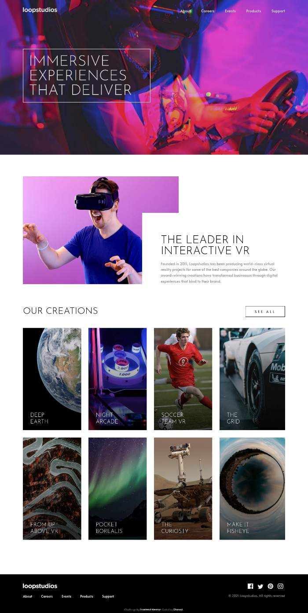

# Frontend Mentor - Loopstudios landing page solution

This is a solution to the [Loopstudios landing page challenge on Frontend Mentor](https://www.frontendmentor.io/challenges/loopstudios-landing-page-N88J5Onjw). Frontend Mentor challenges help you improve your coding skills by building realistic projects. 

### :point_right: [Live Site](https://dhawalrath.github.io/loopstudios-landing-page/)

## :camera: Overview

## 💪 Built with

- Semantic HTML5 markup
- CSS3 (with Grid and Flexbox)
- SASS
- JavaScript (for mobile-menu and date)
- Media Queries (for Mobile design)

## 👨 Author

- Frontend Mentor - [@dhawalRath](https://www.frontendmentor.io/profile/dhawalRath)
- Twitter - [@dhawalRath](https://www.twitter.com/dhawalRath)
